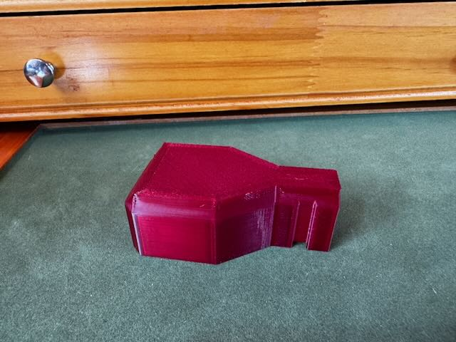
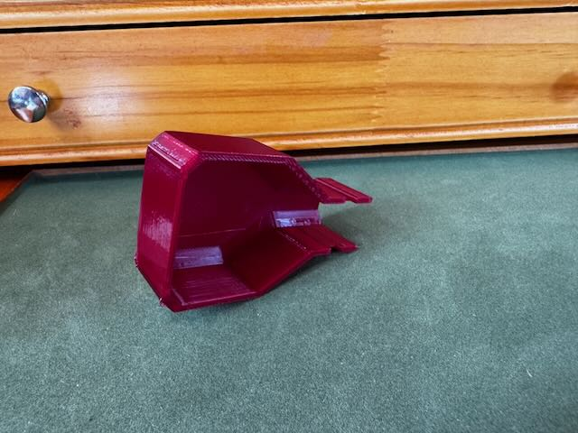
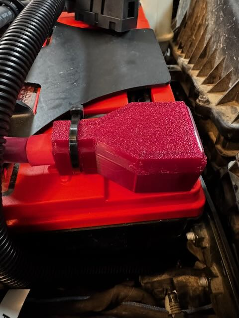

# Car Battery

Car Battery Terminal Boot Covers

A cover for car battery terminals to help protect against accidental short circuit.

This model is parameter driven and can be customized to meet your specific needs.

## Model Parameters

| Parameter            | Description                                                                     |
| -------------------- | ------------------------------------------------------------------------------- |
| boot_width_x         | Boot width that goes over the terminal and clamp.                               |
| boot_length_y        | Boot length that goes over the terminal and clamp.                              |
| boot_height_z        | Overall height of the boot from the base of the battery to the top of the boot. |
| cable_chase_width_y  | Width of the cable chase where the battery cable exits the boot.                |
| cable_chase_length_x | Length of the chase once it is tapered down to cable width.                     |
| boot_taper_len_y     | Distance from the battery terminal box to the point of cable chase.             |
| wall_thickness       | Thickness of all walls                                                          |
| chamfer_size         | Chamfer applied to top edges.                                                   |
| zip_tie_size         | Width of the zip tie notch                                                      |

All values are in millimeters.

## Dependencies and Using the Component

This model is built using the tools listed below and must be installed in order to customize the model.

- [OpenSCAD](https://openscad.org)
- [The Belfry OpenScad Library, v2.0.](https://github.com/BelfrySCAD/BOSL2)

The `*.stl` files are rendered objects.
The `*.3mf` file is an [Orca Slicer](https://orcaslicer.com) project file.

## Example Output

Battery terminal boot that fit my specific use case.

